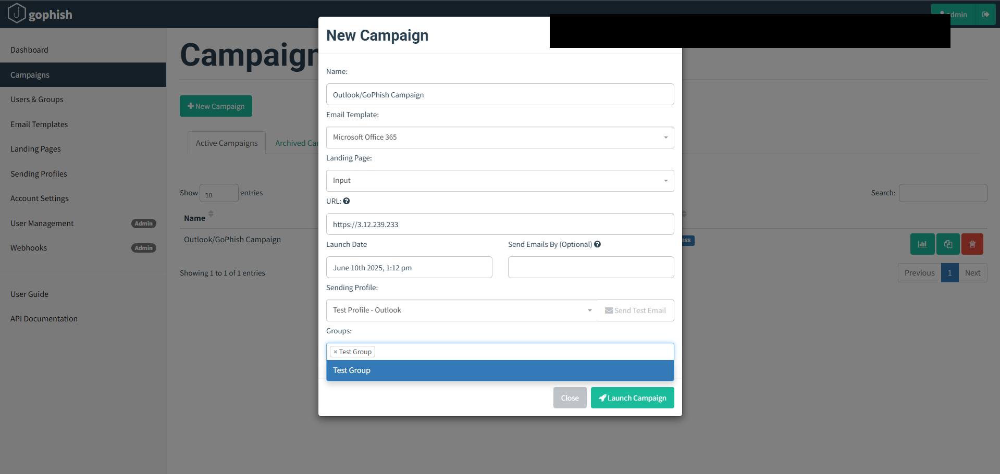
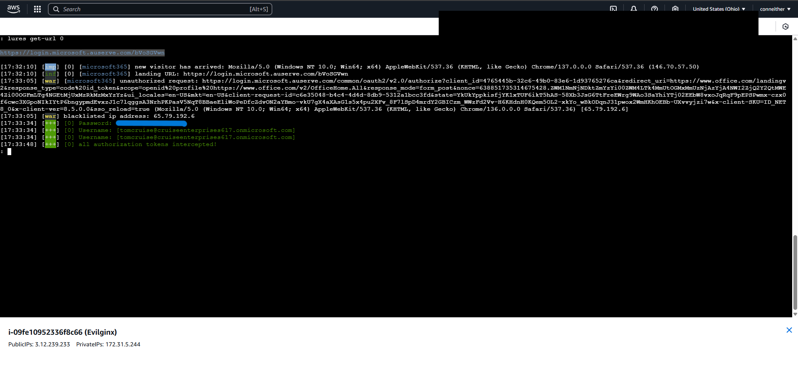

# GoPhish + Evilginx Phishing Simulation Lab

This project simulates a credential-harvesting phishing campaign using [GoPhish](https://getgophish.com) and [Evilginx](https://github.com/kgretzky/evilginx2), hosted on AWS EC2. It was created as a red team learning exercise and to demonstrate practical use of phishing infrastructure, detection logging, and MITRE ATT&CK technique mapping.

---

## Tools Used

- GoPhish (email simulation platform)
- Evilginx2 (phishing proxy w/ credential interception)
- AWS EC2 (Ubuntu host)
- Microsoft Admin portal + Entra ID (email address spoofing)
- Microsoft 365 phishing templates
- ELK stack (external logging and detection, optional)

---

## MITRE ATT&CK Mappings

| Technique             | ID         | Description                            |
|-----------------------|------------|----------------------------------------|
| Spearphishing Link    | T1566.002  | Email with embedded phishing URL       |
| Credential Harvesting | T1556      | Harvesting credentials via fake login  |
| Valid Accounts        | T1078      | Use of harvested credentials           |

---

## Campaign Overview

1. Configured GoPhish with an SMTP sending profile (`smtp-mail.outlook.com:587`)
2. Created realistic email templates based on Microsoft security alerts
3. Deployed Evilginx on AWS and activated `microsoft365` phishlet
4. Assigned test users via GoPhish (`Security Engineer`, `QA Tester`, `CEO`)
5. Launched a live phishing campaign and tracked engagement

---

## Email Authenticity and Entra ID Spoofing

To improve realism and increase click-through rate, the sending address was customized via Entra ID to closely mirror a legitimate Microsoft address. In this case, the user name was set to `account-security-noreply@accountprotection.microsoft.com`, which matches Microsoft’s real domain for security alerts.

The domain `auserve.com` was used to spoof the sender while preserving the visual credibility of the email. This technique effectively bypasses the initial skepticism many users apply when quickly glancing at the From: address.

### Gmail Inbox Example

### Outlook Inbox Example

---

## Landing Page Realism

The phishing landing pages closely mimic real Microsoft login flows. Once users clicked through, they were redirected to a fake Office 365 login portal hosted via Evilginx, complete with SSO prompts and login branding.

### Simulated Login Page (Enter Credentials)

### Simulated Login Page (Stay Signed In)

### Simulated Login Page (Passthrough to Legitimate Session)

---

## Screenshots

### GoPhish Dashboard

### Sending Profile Setup

### Target Group Configuration

### Email Template Preview

### Campaign Launch

### Evilginx Setup + Lure

### Credential Interception (Demo)

  

---

## Lessons Learned

- Importance of simulating realistic email payloads
- Credential capture via Evilginx bypasses MFA (token theft)
- Role of phishing in the early stages of an attack chain
- How threat detection maps to MITRE techniques in a real environment
- Impact of sender impersonation using domain lookalikes and Entra ID spoofing

---

> **Disclaimer:** This project was conducted in a safe lab environment using simulated accounts. No real users or credentials were targeted.