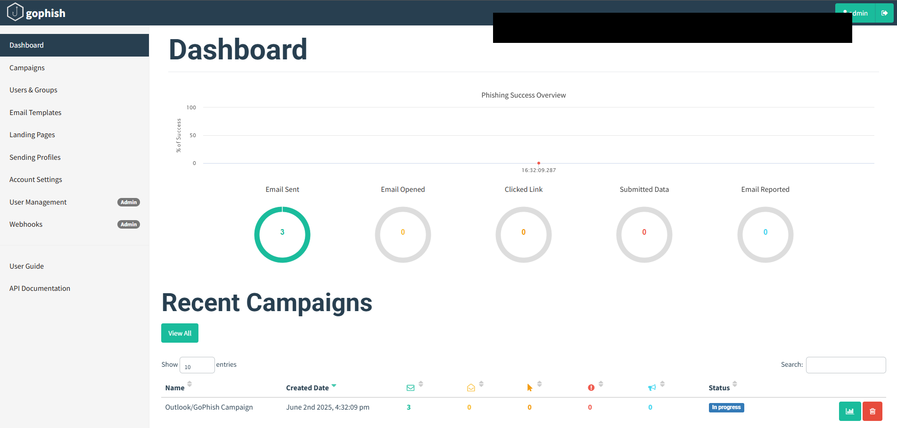
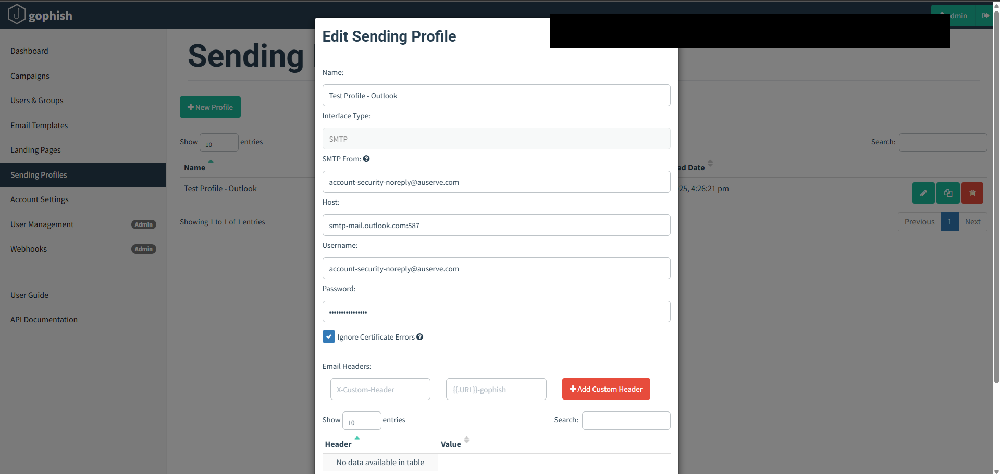
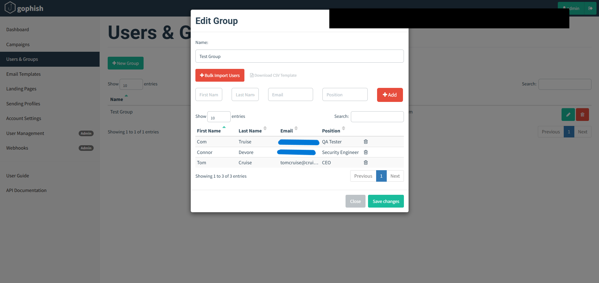
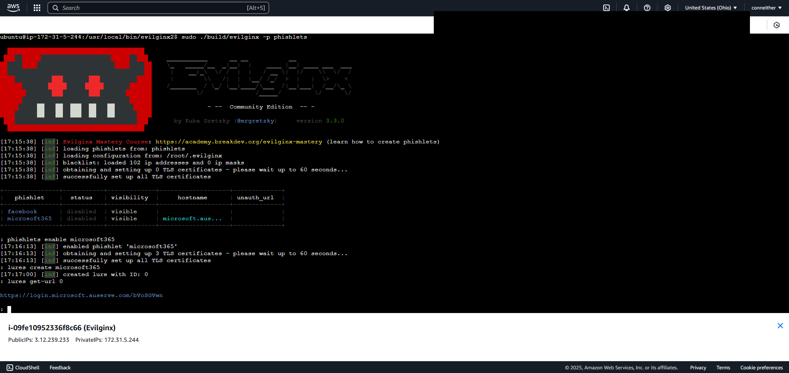

# GoPhish + Evilginx Phishing Simulation Lab

This project simulates a credential-harvesting phishing campaign using [GoPhish](https://getgophish.com) and [Evilginx](https://github.com/kgretzky/evilginx2), hosted on AWS EC2. It was created as a red team learning exercise and to demonstrate practical use of phishing infrastructure, detection logging, and MITRE ATT&CK technique mapping.

---

## 🔧 Tools Used

- GoPhish (email simulation platform)
- Evilginx2 (phishing proxy w/ credential interception)
- AWS EC2 (Ubuntu host)
- Microsoft 365 phishing templates
- ELK stack (external logging and detection, optional)

---

## 🎯 MITRE ATT&CK Mappings

| Technique             | ID         | Description                            |
|-----------------------|------------|----------------------------------------|
| Spearphishing Link    | T1566.002  | Email with embedded phishing URL       |
| Credential Harvesting | T1556      | Harvesting credentials via fake login  |
| Valid Accounts        | T1078      | Use of harvested credentials           |

---

## 🚀 Campaign Overview

1. Configured GoPhish with an SMTP sending profile (`smtp-mail.outlook.com:587`)
2. Created realistic email templates based on Microsoft security alerts
3. Deployed Evilginx on AWS and activated `microsoft365` phishlet
4. Assigned test users via GoPhish (`Security Engineer`, `QA Tester`, `CEO`)
5. Launched a live phishing campaign and tracked engagement

---

## 📸 Screenshots

### GoPhish Dashboard

### Sending Profile Setup

### Target Group Configuration

### Email Template Preview

### Campaign Launch

### Evilginx Setup + Lure

### Credential Interception (Demo)

---

## 🧠 Lessons Learned

- Importance of simulating realistic email payloads
- Credential capture via Evilginx bypasses MFA (token theft)
- Role of phishing in the early stages of an attack chain
- How threat detection maps to MITRE techniques in a real environment

---

> **Disclaimer:** This project was conducted in a safe lab environment using simulated accounts. No real users or credentials were targeted.
